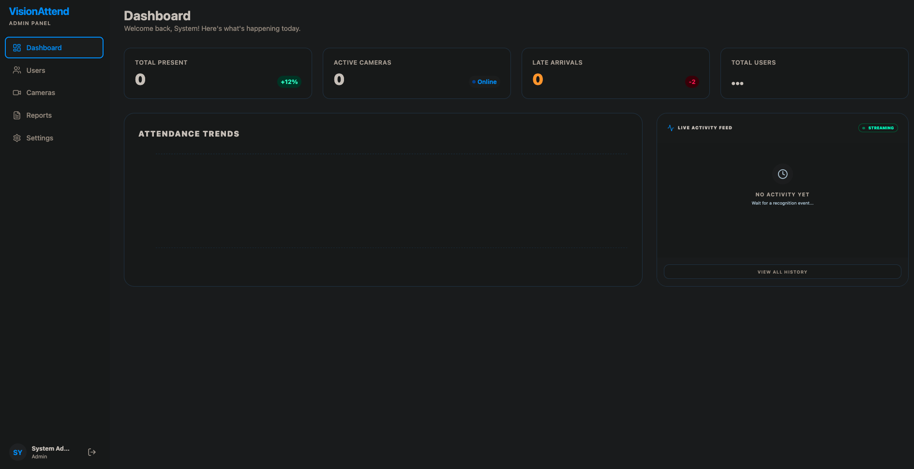
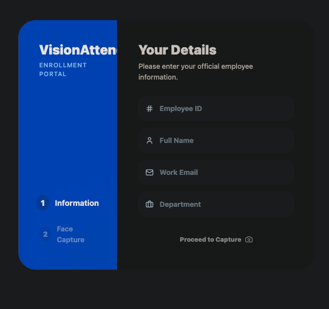
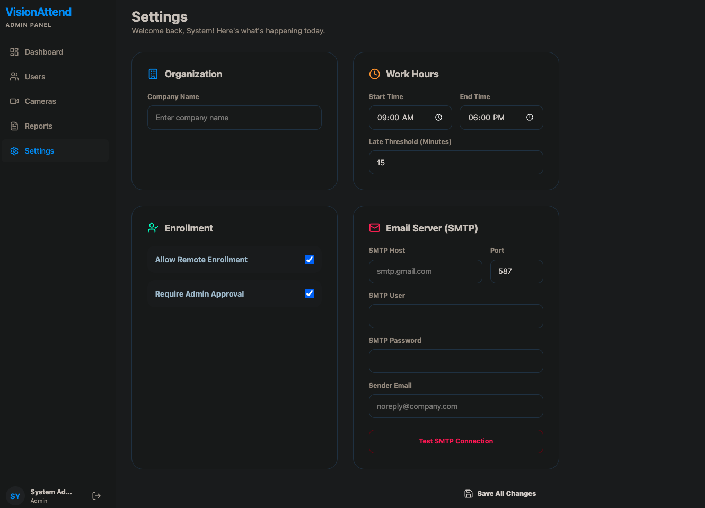
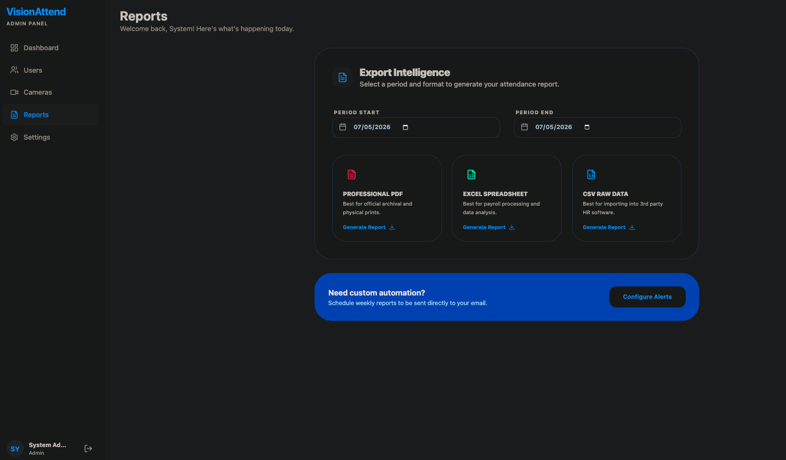

# 🚀 VisionAttend: AI-Powered Attendance Intelligence

VisionAttend is a high-performance, enterprise-grade facial recognition attendance system designed for modern workplaces.

---

## 📋 Table of Contents
- [Why Need of this project?](#❓-why-need-of-this-project)
- [Solution Overview](#💡-solution-overview)
- [Visual Preview](#📸-visual-preview)
- [Quick Start with Docker](#🚀-quick-start-with-docker)
- [Core Features](#🌟-core-features)
- [Configuration](#⚙️-configuration)
- [Architecture](#🏗️-architecture)
- [Contributing](#🤝-contributing)
- [License](#📄-license)

---

## ❓ Why Need of this project?
Traditional attendance systems suffer from significant friction and security gaps:
- **Time Theft**: "Buddy punching" or card-sharing remains a major issue in manual or RFID-based systems.
- **Latency**: Manual logging or slow scanners create bottlenecks during peak entry/exit hours.
- **Data Silos**: Many systems lack real-time analytics or automated reporting, making attendance management a reactive task.
- **High Friction Onboarding**: Physical card issuance or manual profile setup is time-consuming for large organizations.

---

## 💡 Solution Overview
VisionAttend solves these problems by leveraging cutting-edge Computer Vision and Vector Search:
- **Biometric Integrity**: Facial recognition ensures that the person being logged is actually present.
- **Sub-Millisecond Search**: Using FAISS (Facebook AI Similarity Search), we can identify a face among thousands in milliseconds.
- **Zero-Contact Integration**: Employees simply walk past a camera; no physical contact or specialized hardware (beyond a standard RTSP/USB camera) is required.
- **Automated Lifecycle**: From remote enrollment to automated email reports, the entire attendance lifecycle is hands-off.

---

## 📸 Visual Preview

| Admin Dashboard | Remote Enrollment |
|:---:|:---:|
|  |  |

| System Settings | Analytical Reports |
|:---:|:---:|
|  |  |

---

## 🚀 Quick Start with Docker

### 1. Prerequisites
- [Docker](https://www.docker.com/get-started) and [Docker Compose](https://docs.docker.com/compose/install/)
- At least 4GB of RAM (for AI model inference)

### 2. Launching the Stack
```bash
git clone <your-repo-url>
cd vision-attend
docker compose up --build -d
```

### 3. Initial Setup
- **Access App**: `https://localhost` (Handles SSL automatically)
- **Admin Login**: `admin` / `admin123`
- **Enrollment Portal**: `https://localhost/enroll` (For public employee onboarding)

---

## 🌟 Core Features
- **⚡ Lightning-Fast Engine**: MTCNN detection + InceptionResnetV1 embeddings.
- **📹 Dynamic ROI Configuration**: Draw "Focus Zones" on MJPEG streams to focus recognition on specific entry points.
- **📲 Remote Enrollment**: Mobile-friendly onboarding with admin approval queue.
- **🛡️ Production Hardening**:
  - **Rate Limiting**: Public endpoints are protected by `slowapi`.
  - **Field Encryption**: Sensitive SMTP credentials stored with AES-256 (Fernet).
  - **Premium UI**: Non-blocking toast notifications via `sonner`.
- **📧 Automated Reporting**: One-click exports in PDF, Excel, and CSV.

---

## ⚙️ Configuration
The system is configured via environment variables in `backend/.env`.

| Variable | Description | Default |
|----------|-------------|---------|
| `ENCRYPTION_KEY` | 32-byte Fernet key for sensitive fields | (Required) |
| `SECRET_KEY` | JWT signing key | (Required) |
| `DATABASE_URL` | SQLite or PostgreSQL connection string | `sqlite:///./vision_attend.db` |
| `ALLOW_REMOTE_ENROLL` | Toggle public onboarding portal | `true` |

---

## 🏗️ Architecture
VisionAttend uses a modern, decoupled architecture:

### 🧩 Components
- **FastAPI Backend**: Asynchronous API layer with modular dependency injection.
- **React Frontend**: High-performance SPA with Zustand state management.
- **Vision Service**: Dedicated layer for PyTorch model inference and FAISS indexing.
- **Nginx Proxy**: High-performance reverse proxy for SSL termination and static serving.

### 📂 File Structure
```text
vision-attend/
├── backend/            # FastAPI Application
│   ├── app/
│   │   ├── api/        # Routers (Auth, Users, Cameras, Analytics, Enrollment)
│   │   ├── core/       # Security (Limiter, Encryption, JWT)
│   │   ├── models/     # SQLModel Schemas
│   │   └── services/   # AI Engine, FAISS, Camera Manager
├── frontend/           # React + Vite Application
│   └── src/            # Components, Store, Pages
└── docs/               # Detailed documentation
```

---

## 🤝 Contributing
Contributions are welcome! Please follow these steps:
1. Fork the repository.
2. Create a feature branch (`git checkout -b feature/AmazingFeature`).
3. Commit your changes (`git commit -m 'Add some AmazingFeature'`).
4. Push to the branch (`git push origin feature/AmazingFeature`).
5. Open a Pull Request.

---

## 📄 License
This project is licensed under the MIT License - see the [LICENSE](LICENSE) file for details.
