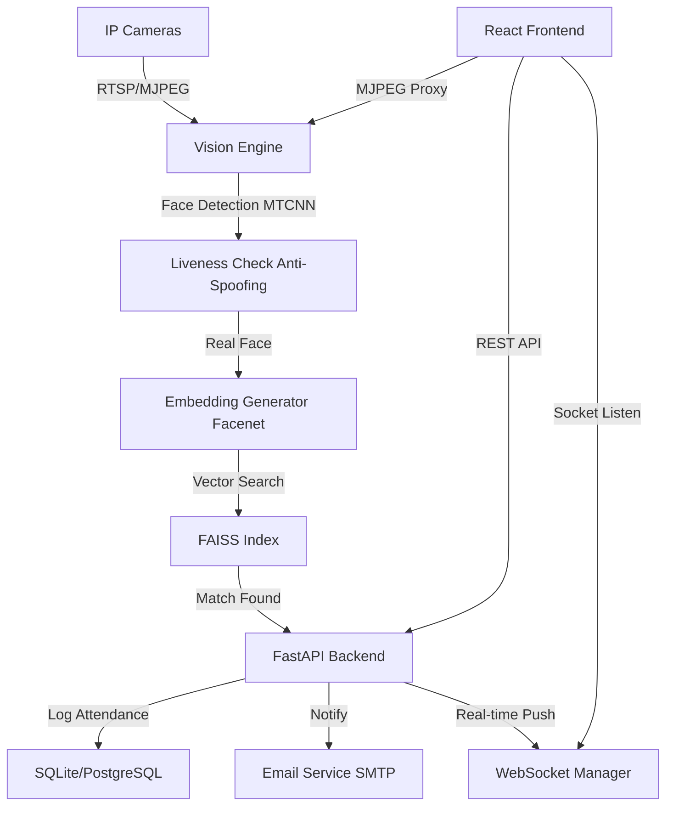

# Architecture & Design

VisionAttend is designed as a modular, high-performance attendance system using modern web and AI technologies. It is optimized for low-latency recognition and premium user experience.

## High-Level Diagram

## Backend Components

### 1. API Layer (FastAPI)
- Uses **SQLModel** for unified DB modeling and validation.
- Implements **JWT** authentication with a centralized `deps.py` for modular security.
- **WebSocket Manager**: Handles real-time event broadcasting to active dashboards.

### 2. Vision Service
- **Detection**: MTCNN is used for robust face detection.
- **Recognition**: InceptionResnetV1 (FaceNet) generates 512-dimensional face embeddings.
- **Anti-Spoofing**: `LivenessService` analyzes texture variance and color distributions to block photo/video spoofing.
- **Search**: FAISS (Facebook AI Similarity Search) provides sub-millisecond lookups.

### 3. Utility Services
- **EmailService**: Manages HTML-based notifications for enrollment status updates.
- **Crypto Manager**: Ensures secure storage of sensitive credentials (SMTP passwords).

## Frontend Components

### 1. React (Vite)
- A modern SPA architecture with **Zustand** for global state.
- **React Query**: Manages server state and data fetching with automated cache invalidation.
- **Vanilla CSS**: Premium, custom-tailored aesthetics including glassmorphism and smooth transitions.

### 2. Interactive Features
- **ROI Editor**: Interactive canvas overlay for defining recognition zones.
- **Employee Portal**: Dedicated public view for history lookup by Employee ID.
- **Live Activity Feed**: WebSocket-powered toast notifications for instant feedback.
