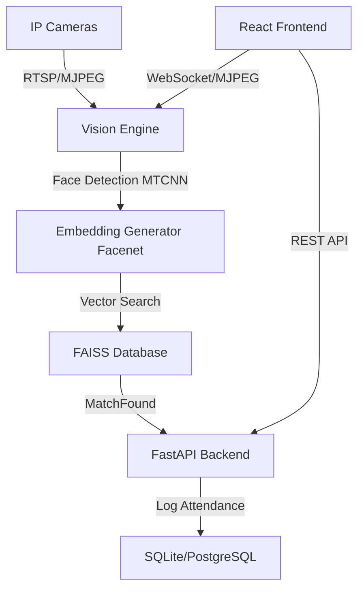

# Architecture & Design

VisionAttend is designed as a modular, high-performance attendance system using modern web and AI technologies.

## High-Level Diagram

## Backend Components

### 1. API Layer (FastAPI)
- Uses **SQLModel** for unified DB modeling and validation.
- Implements **JWT** authentication with a centralized `deps.py` for modular security.
- Routers are segregated by domain: `auth`, `users`, `cameras`, `analytics`, `enrollment`, `settings`.

### 2. Vision Service
- **Detection**: MTCNN is used for robust face detection even in varied lighting.
- **Recognition**: InceptionResnetV1 (FaceNet) generates 512-dimensional face embeddings.
- **Search**: FAISS (Facebook AI Similarity Search) provides sub-millisecond lookups across thousands of faces.

### 3. State Management
- Persistence is handled by SQLModel.
- AI state (embeddings) is periodically synced from the database to the FAISS index to ensure consistency across restarts.

## Frontend Components

### 1. React (Vite)
- A modern SPA architecture optimized for performance.
- **Zustand** for lightweight global state (Auth, User context).
- **Vanilla CSS** for premium, custom-tailored aesthetics (Dark Mode, Glassmorphism).

### 2. Interactive Features
- **ROI Editor**: Allows admins to define "active zones" on camera streams using an interactive canvas overlay.
- **Capture Wizard**: Multi-step guide for local face enrollment.
- **Remote Enrollment**: Mobile-responsive page for employees to submit face data remotely.
